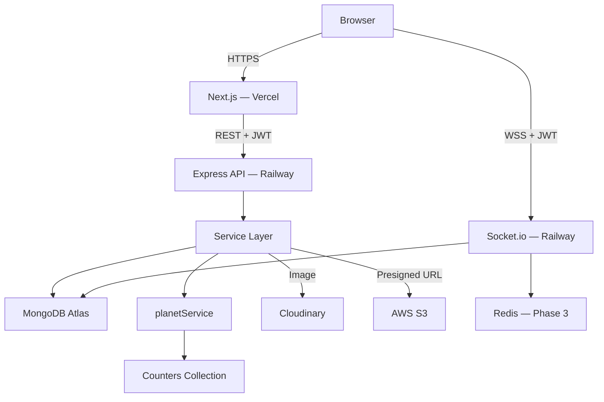

# DOSMOS — Implementation Plan v5 (Final, All Decisions Locked)

**Tagline:** A deeply personal, private communication universe
**DOSMOS = Deepanshu's Cosmos**

> [!IMPORTANT]
> This is the **final resolved plan**. All open questions are answered. All critical issues are fixed. Ready to code.

---

## Version History

| Version | Key Changes |
|---------|-------------|
| v1 | Initial architecture |
| v2 | Auth hardening, JWT rotation, Chat model, Socket auth, Indexes, Service layer, Security |
| v3 | Step token spec, DB account lock, Server timestamps, Socket re-auth, Presigned URL security, ownChat REST guard, last_seen_message_id, GIF storage, CSP, Next.js socket rule |
| v4 | Planet Identity System — generation engine, registration flow, 4 new screens, Universe View nodes |
| **v5** | **Atomic orbitIndex counter, unique planet.name index + try-insert, is_verified, rename cooldown, planet slug/is_active/metadata, auto welcome message, canRegister guard, answer normalization, step token nonce — ALL QUESTIONS RESOLVED** |

---

## Final Decisions (Locked)

| Decision | Answer |
|----------|--------|
| GIPHY API | Phase 1-2: mock/skip. Phase 3: real GIPHY API |
| Admin seeding | `npm run seed:admin` script only. No `/setup` route. |
| Answer normalization | lowercase + trim + remove punctuation + normalize spaces |
| Step token nonce | ✅ Yes — `active_step_token_id` in User model |
| Registration threshold | 2 failed attempts |
| Planet birth screen | Full-page (non-negotiable — brand signature moment) |

---

## Architecture



> [!IMPORTANT]
> Socket.io runs **only on Railway**. Zero Socket.io code in Next.js App Router.

---

## Final Data Models

### Counters Collection (NEW — atomic sequences)

```js
// models/Counter.js
{
  name:  String,   // e.g. "orbitIndex"
  value: Number,   // auto-incremented atomically
}

// Usage (no race conditions, ever):
const counter = await Counter.findOneAndUpdate(
  { name: "orbitIndex" },
  { $inc: { value: 1 } },
  { new: true, upsert: true }
);
return counter.value;   // guaranteed unique
```

---

### User (Final)

```js
{
  _id,
  name:      String,
  dob:       Date,
  role:      { type: String, enum: ["admin", "user"] },

  // ── Auth (pre-seeded users only) ──────────────────────────────
  question:    { type: String,  default: null },
  answer_hash: { type: String,  default: null },   // bcrypt cost 12

  // ── Security ──────────────────────────────────────────────────
  failed_attempts:      { type: Number,  default: 0 },
  lock_until:           { type: Date,    default: null },
  active_step_token_id: { type: String,  default: null },  // nonce — 1 active step token per user

  // ── Planet (self-registered users) ────────────────────────────
  planet: {
    name:       String,          // "Zyphora"
    slug:       String,          // "zyphora-64abc123"  ← unique, URL-safe
    type:       String,          // "Rocky"|"Ocean"|"Gas Giant"|"Ice"
    color:      String,          // hex e.g. "#4FC3F7"
    orbitIndex: Number,          // atomic counter value
    size:       { type: Number, default: 40 },
    metadata: {
      seed:    Number,           // 0..1 float — store for future re-generation
      version: { type: Number, default: 1 },  // planet engine version
    },
    createdAt:  Date,
  },

  // ── Moderation ────────────────────────────────────────────────
  is_verified: { type: Boolean, default: false },   // admin manually verifies
  is_active:   { type: Boolean, default: true },    // moderation / soft ban

  // ── Planet Rename Cooldown ────────────────────────────────────
  last_renamed_at: { type: Date, default: null },   // max 1 rename / 24 hrs

  // ── Preferences ───────────────────────────────────────────────
  theme_preferences: { type: Object, default: {} },

  created_at: Date,
}
```

---

### Chat

```js
{
  _id,
  participants:    [ObjectId],     // [userId, adminId]
  last_message:    String,
  last_message_at: Date,
  read_state: [
    { userId: ObjectId, last_seen_message_id: ObjectId }
  ],
  created_at: Date,
}
```

---

### Message

```js
{
  _id,
  chat_id:    ObjectId,
  sender_id:  ObjectId,
  type:       { type: String, enum: ["text", "image", "audio", "gif"] },
  content:    Mixed,             // String for text/image/audio; Object for gif
  is_deleted: { type: Boolean, default: false },
  is_system:  { type: Boolean, default: false },   // for auto welcome message
  created_at: Date,              // SERVER-GENERATED ONLY — never trust client
}
```

---

### RefreshToken

```js
{
  _id,
  userId:               ObjectId,
  tokenHash:            String,    // bcrypt hash
  refreshTokenVersion:  Number,
  expiresAt:            Date,
  ipAddress:            String,
  userAgent:            String,
  createdAt:            Date,
}
```

---

## MongoDB Indexes (Complete Final List)

```js
// ── Users ───────────────────────────────────────────────────────
db.users.createIndex({ dob: 1 })
db.users.createIndex({ role: 1 })
db.users.createIndex({ lock_until: 1 })
db.users.createIndex({ is_active: 1 })
db.users.createIndex({ "planet.orbitIndex": 1 })
db.users.createIndex(
  { "planet.name": 1 },
  { unique: true, sparse: true }          // unique planet names; sparse = excludes null (admin)
)
db.users.createIndex(
  { "planet.slug": 1 },
  { unique: true, sparse: true }
)
db.users.createIndex(
  { dob: 1, name: 1 },
  { collation: { locale: "en", strength: 2 } }  // case-insensitive duplicate check
)

// ── Counters ─────────────────────────────────────────────────────
db.counters.createIndex({ name: 1 }, { unique: true })

// ── Chats ─────────────────────────────────────────────────────────
db.chats.createIndex({ participants: 1 })
db.chats.createIndex({ last_message_at: -1 })
db.chats.createIndex({ "read_state.userId": 1 })

// ── Messages ──────────────────────────────────────────────────────
db.messages.createIndex({ chat_id: 1, created_at: 1 })  // compound — primary pagination
db.messages.createIndex({ chat_id: 1, _id: 1 })          // tiebreaker sort
db.messages.createIndex({ sender_id: 1 })
db.messages.createIndex({ is_deleted: 1, chat_id: 1 })
db.messages.createIndex({ is_system: 1 })

// ── RefreshTokens ─────────────────────────────────────────────────
db.refreshtokens.createIndex({ userId: 1 })
db.refreshtokens.createIndex(
  { expiresAt: 1 },
  { expireAfterSeconds: 0 }              // MongoDB auto-deletes expired tokens
)
```

---

## 🔴 Fix 1 — Atomic orbitIndex (No Race Condition)

```js
// services/planetService.js
async function getNextOrbitIndex() {
  const counter = await Counter.findOneAndUpdate(
    { name: "orbitIndex" },
    { $inc: { value: 1 } },
    { new: true, upsert: true }   // atomic — safe under concurrent registrations
  );
  return counter.value;
}
```

---

## 🔴 Fix 2 — Planet Name Uniqueness (Performance-Safe)

**Strategy:** Unique DB index + try-insert on conflict (no polling loop).

```js
// services/planetService.js
async function createUserWithUniquePlanet(userData, planetData, maxRetries = 5) {
  for (let attempt = 0; attempt < maxRetries; attempt++) {
    const planetName = attempt === 0
      ? planetData.name
      : `${planetData.name}-${attempt + 1}`;

    const slug = generateSlug(planetName, userData._id);  // "zyphora-64abc123"

    try {
      const user = await User.create({
        ...userData,
        planet: { ...planetData, name: planetName, slug },
      });
      return user;    // ← success on first unique name
    } catch (err) {
      if (err.code === 11000 && err.keyPattern?.["planet.name"]) {
        continue;     // ← duplicate key → try next suffix
      }
      throw err;      // ← unrelated error → rethrow
    }
  }
  throw new Error("Could not generate unique planet name after max retries");
}

function generateSlug(name, userId) {
  const short = userId.toString().slice(-8);   // last 8 chars of ObjectId
  return `${name.toLowerCase().replace(/\s+/g, "-")}-${short}`;
  // e.g. "zyphora-64abc123"
}
```

---

## 🔴 Fix 3 — Identity Anchor (`is_verified`)

```js
// On registration: is_verified defaults to false
// Admin can manually set is_verified: true per user

// Future capabilities unlocked by is_verified:
// - Optional security question (Phase 2)
// - Blue-tick style indicator in Universe View
// - Priority in admin dashboard
```

**Admin verification endpoint (Phase 2):**
```
PATCH /api/admin/users/:userId/verify
Body: { is_verified: true }
Auth: Admin JWT only
```

---

## 🔴 Fix 4 — Planet Rename Cooldown (24hr)

```js
// services/planetService.js
async function renamePlanet(userId, newName) {
  const user = await User.findById(userId).select("last_renamed_at planet");

  // Enforce 24-hour cooldown
  if (user.last_renamed_at) {
    const hoursSinceRename = (Date.now() - user.last_renamed_at) / (1000 * 60 * 60);
    if (hoursSinceRename < 24) {
      const hoursLeft = Math.ceil(24 - hoursSinceRename);
      throw new AppError(`You can rename your planet in ${hoursLeft} hour(s).`, 429);
    }
  }

  const sanitized = sanitizeName(newName);     // xss + trim + profanity check
  const newSlug   = generateSlug(sanitized, userId);

  // Try update (unique index handles collision)
  try {
    return await User.findByIdAndUpdate(
      userId,
      {
        "planet.name":     sanitized,
        "planet.slug":     newSlug,
        last_renamed_at:   new Date(),
      },
      { new: true, runValidators: true }
    ).select("planet last_renamed_at");
  } catch (err) {
    if (err.code === 11000) throw new AppError("Planet name already taken.", 409);
    throw err;
  }
}
```

---

## Answer Normalization (Final, Locked)

```js
// utils/hash.js
export function normalizeAnswer(answer) {
  return answer
    .toLowerCase()
    .trim()
    .replace(/[^\w\s]/gi, "")   // remove all punctuation
    .replace(/\s+/g, " ");      // collapse multiple spaces to single
}

// On seed / user creation:
answer_hash = await bcrypt.hash(normalizeAnswer(rawAnswer), 12)

// On verify:
const match = await bcrypt.compare(normalizeAnswer(submittedAnswer), user.answer_hash)
```

**Effect:**
```
"Fluffy!"  →  "fluffy"
"My Cat."  →  "my cat"
"  FLUFFY " →  "fluffy"
" My  Cat" →  "my cat"
→ All of the above match each other ✅
```

---

## Step Token Nonce (Final, Locked)

```js
// Every time a step token is issued:
const tokenId = crypto.randomUUID();

const stepToken = jwt.sign(
  { userId, step, attemptsLeft, tokenId },
  process.env.JWT_STEP_SECRET,
  { expiresIn: "2m" }
);

// Save nonce to user (invalidates any previous step token)
await User.updateOne({ _id: userId }, { active_step_token_id: tokenId });

// On any step token usage — verify nonce:
async function validateStepToken(token) {
  const payload = jwt.verify(token, process.env.JWT_STEP_SECRET);
  const user = await User.findById(payload.userId).select("active_step_token_id");

  if (user.active_step_token_id !== payload.tokenId) {
    throw new AuthError("Step token already used or superseded.");
  }
  return payload;
}

// On auth success — clear nonce:
await User.updateOne({ _id: userId }, { active_step_token_id: null });
```

---

## Auto Welcome Message on Registration

```js
// services/authService.js — inside register() after chat creation
async function sendWelcomeMessage(chatId, adminId) {
  await Message.create({
    chat_id:    chatId,
    sender_id:  adminId,        // appears to come from Admin
    type:       "text",
    content:    "Hey 👋 welcome to DOSMOS",
    is_system:  true,           // flagged as system message
    created_at: new Date(),
  });

  await Chat.updateOne(
    { _id: chatId },
    {
      last_message:    "Hey 👋 welcome to DOSMOS",
      last_message_at: new Date(),
    }
  );
}

// In register():
const chat = await chatService.createChat(user._id, admin._id);
await sendWelcomeMessage(chat._id, admin._id);
```

**UI rendering of system messages:**
```ts
// MessageBubble.tsx
{message.is_system && (
  <div className="system-message">
    {message.content}
  </div>
)}
// Centered, italic, no sender avatar — distinct visual treatment
```

---

## canRegister Frontend Guard

**Problem:** User directly navigates to `/register` without going through auth flow.

**Solution:** Short-lived `canRegister` cookie + frontend state check.

```ts
// Set when failed_attempts >= 2 in auth response:
// Server sets: Set-Cookie: canRegister=true; Max-Age=600; HttpOnly; SameSite=Strict

// Frontend middleware (Next.js middleware.ts):
export function middleware(req: NextRequest) {
  const pathname = req.nextUrl.pathname;

  if (pathname.startsWith("/register")) {
    const canRegister = req.cookies.get("canRegister")?.value;
    if (!canRegister) {
      return NextResponse.redirect(new URL("/", req.url));
    }
  }
}

// Clear canRegister cookie on successful registration:
res.clearCookie("canRegister");
```

**Auth flow sets the cookie:**
```js
// When failed_attempts reaches threshold (2):
res.cookie("canRegister", "true", {
  maxAge: 600,         // 10 minutes to complete registration
  httpOnly: true,
  sameSite: "strict",
  secure: process.env.NODE_ENV === "production",
});
res.status(200).json({
  canRegister: true,
  attemptsLeft: 0,
  message: "We couldn't verify your identity.",
});
```

---

## POST /api/auth/register — Final Implementation

```js
// services/authService.js
async function register(name, dob, ip) {
  // 1. Validate inputs
  const safeName = xss(name.trim());
  if (safeName.length < 2 || safeName.length > 30) throw new ValidationError("Invalid name");
  if (new Date(dob) > new Date()) throw new ValidationError("DOB cannot be in the future");

  // 2. Admin guard
  const admin = await User.findOne({ role: "admin" }).select("dob name");
  if (
    admin.dob.toDateString() === new Date(dob).toDateString() &&
    admin.name.toLowerCase() === safeName.toLowerCase()
  ) throw new AuthError("Forbidden", 403);

  // 3. Generate planet data
  const seed      = generateSeed(dob, safeName);
  const typeData  = getPlanetType(seed);
  const color     = getPlanetColor(seed, typeData);
  const rawName   = generatePlanetName(seed);
  const orbitIdx  = await getNextOrbitIndex();   // atomic counter

  const planetData = {
    name: rawName,
    type: typeData.type,
    color,
    orbitIndex: orbitIdx,
    size: 40,
    metadata: { seed, version: 1 },
    createdAt: new Date(),
  };

  const userData = {
    name: safeName,
    dob: new Date(dob),
    role: "user",
    is_verified: false,
    is_active: true,
    failed_attempts: 0,
    created_at: new Date(),
  };

  // 4. Create user (unique planet name handled by try-insert)
  const user = await createUserWithUniquePlanet(userData, planetData);

  // 5. Auto-create chat + welcome message
  const chat = await chatService.createChat(user._id, admin._id);
  await sendWelcomeMessage(chat._id, admin._id);

  // 6. Issue tokens + clear canRegister cookie
  const tokens = await issueTokens(user);

  return { user, chat, tokens };
}
```

---

## Complete Auth Flow (Final State Machine)

```
ENTRY /
  │
  ▼
POST /auth/dob
  ├─ No match ──────────────────────────────────────────────────────┐
  └─ Match → { maskedName, stepToken(step:"dob_verified") }         │
       │                                                             │
       ▼                                                             │
POST /auth/question (stepToken required)                             │
  └─ { question, stepToken(step:"question_fetched") }               │
       │                                                             │
       ▼                                                             │
POST /auth/verify (stepToken + answer)                               │
  ├─ Correct → JWT issued → /chat or /admin                         │
  └─ Wrong → failed_attempts++                                       │
       ├─ < 2 → retry                                                │
       └─ >= 2 → set canRegister cookie ────────────────────────────┤
                                                                     │
                          /register (canRegister cookie required) ◄──┘
                          "We couldn't verify your identity."
                          [Create My Planet] [Try Again]
                               │
                          /register/create
                          Name + DOB form
                               │
                          POST /auth/register
                          → planet generated (atomic orbitIndex)
                          → user created (unique name via try-insert)
                          → chat auto-created
                          → welcome message sent
                          → JWT issued
                          → canRegister cookie cleared
                               │
                          /register/born
                          Full-page planet birth animation (7 phases)
                               │
                          /chat (auto-transition after animation)
                          "Hey 👋 welcome to DOSMOS" visible
```

---

## Complete API Endpoint Map (Final)

### Auth
| Method | Route | Auth | Description |
|--------|-------|------|-------------|
| POST | `/api/auth/dob` | None | DOB probe → masked name + step token |
| POST | `/api/auth/question` | Step token | Question fetch |
| POST | `/api/auth/verify` | Step token | Answer verify → JWT |
| POST | `/api/auth/register` | None (canRegister cookie) | Planet registration |
| POST | `/api/auth/refresh` | Refresh cookie | Token rotation |
| POST | `/api/auth/logout` | JWT | Revoke refresh token |

### Users
| Method | Route | Auth | Description |
|--------|-------|------|-------------|
| GET | `/api/users/me` | JWT | Current user profile |
| PATCH | `/api/users/planet/rename` | JWT (user) | Rename planet (24hr cooldown) |
| PATCH | `/api/users/theme` | JWT | Update theme preferences |
| PATCH | `/api/admin/users/:userId/verify` | JWT (admin) | Manually verify user |

### Chats
| Method | Route | Auth | Description |
|--------|-------|------|-------------|
| GET | `/api/chats` | JWT | Admin: all chats. User: own chat |
| GET | `/api/chats/:chatId` | JWT + ownChat | Single chat details |

### Messages
| Method | Route | Auth | Description |
|--------|-------|------|-------------|
| GET | `/api/chats/:chatId/messages` | JWT + ownChat | Paginated history |
| POST | `/api/chats/:chatId/messages` | JWT + ownChat | REST fallback send |
| PATCH | `/api/chats/:chatId/messages/:msgId/seen` | JWT + ownChat | Mark seen |

### Media
| Method | Route | Auth | Description |
|--------|-------|------|-------------|
| POST | `/api/media/image` | JWT | Cloudinary upload |
| POST | `/api/media/audio-url` | JWT | Presigned S3 URL |

---

## Complete Backend Folder Structure (Final)

```
backend/
├── src/
│   ├── models/
│   │   ├── User.js
│   │   ├── Chat.js
│   │   ├── Message.js
│   │   ├── RefreshToken.js
│   │   └── Counter.js             ← NEW (atomic orbitIndex)
│   │
│   ├── controllers/
│   │   ├── authController.js      (register added)
│   │   ├── chatController.js
│   │   ├── messageController.js
│   │   ├── userController.js      (renamePlanet, verifyUser)
│   │   └── mediaController.js
│   │
│   ├── services/
│   │   ├── authService.js         (register, issueTokens, normalizeAnswer)
│   │   ├── chatService.js         (createChat, unread via last_seen_message_id)
│   │   ├── messageService.js      (create, paginate, markSeen, sendWelcome)
│   │   ├── mediaService.js        (presigned S3, Cloudinary)
│   │   └── planetService.js       (generatePlanet, renamePlanet, getNextOrbitIndex)
│   │
│   ├── routes/
│   │   ├── auth.js
│   │   ├── chat.js
│   │   ├── messages.js
│   │   ├── users.js
│   │   └── media.js
│   │
│   ├── middleware/
│   │   ├── authenticate.js        (JWT guard)
│   │   ├── ownChat.js             (chat ownership on all REST routes)
│   │   ├── rateLimit.js           (authLimiter + registerLimiter)
│   │   └── errorHandler.js
│   │
│   ├── socket/
│   │   ├── middleware.js          (JWT verify on io.use)
│   │   └── handlers.js            (events → services)
│   │
│   ├── utils/
│   │   ├── hash.js                (bcrypt + normalizeAnswer)
│   │   ├── token.js               (access, refresh, step token)
│   │   ├── mask.js                (name masking)
│   │   ├── planetSeed.js          (generateSeed, getPlanetType, getPlanetColor)
│   │   └── planetNameGen.js       (generatePlanetName — phoneme-based)
│   │
│   └── index.js                   (app entry, helmet, cors, socket)
│
├── scripts/
│   └── seed:admin.js              ← npm run seed:admin (only way to create admin)
│
└── .env
```

---

## Complete Frontend Screens (Final)

| Route | Screen | Trigger |
|-------|--------|---------|
| `/` | Entry — DOB Picker | Landing |
| `/verify` | Identity Confirm — Masked Name | DOB match |
| `/auth` | Personal Question | Identity confirmed |
| `/register` | Failure + CTA | failed_attempts >= 2 + canRegister cookie |
| `/register/create` | Registration Form | User clicks "Create My Planet" |
| `/register/born` | **Planet Birth — Full Page** | POST /register success |
| `/chat` | User Chat | Auth success or post-registration |
| `/admin` | Universe View — Planet Canvas | Admin login |
| `/admin/[userId]` | Admin ↔ User Chat | Node click |

---

## Planet Birth Screen — Full Page (7 Phases)

```
Phase 1 (0–0.5s):   Pure black — nothing
Phase 2 (0.5–1.5s): Tiny glowing dot at center (planet color, 4px)
Phase 3 (1.5–2.5s): Dot expands → full planet circle (40px), rotation begins
Phase 4 (2.5–3s):   Orbit ring fades in (thin stroke, same color, 20% opacity)
Phase 5 (3–3.5s):   Planet name materializes below ("Zyphora")
Phase 6 (3.5–4s):   Text appears:
                     "Your planet 'Zyphora' has been created 🌍
                      You are now part of DOSMOS."
Phase 7 (4–4.5s):   [ Begin → ] button pulses in

Implementation:
  Framer Motion variants + animate prop
  CSS: radial-gradient for planet surface texture
  box-shadow for glow: 0 0 40px {color}
  Orbit: border: 1px solid {color}40 + CSS rotate animation
  Background: #000 with subtle star field (CSS box-shadow multi-point trick)
```

---

## Security Checklist (v5 Final)

- [x] DOB probe: identical error for match/no-match (enumeration-safe)
- [x] Masked name only at step 1 — real name never leaked
- [x] Question only returned after step token with correct step field
- [x] Step tokens: separate `JWT_STEP_SECRET`, 2-min TTL, single-use
- [x] Step token nonce (`active_step_token_id`) — max 1 active per user
- [x] Nonce cleared on success, checked on every step
- [x] Answers normalized (lowercase + trim + punctuation removed)
- [x] Answers hashed with bcrypt (cost 12)
- [x] `failed_attempts` + `lock_until` in DB (restart-safe persistent lock)
- [x] Registration only accessible with `canRegister` cookie
- [x] Registration: IP rate limit (3/15min)
- [x] Registration: case-insensitive duplicate check (dob + name)
- [x] Registration: admin guard (403 if matches admin)
- [x] Registration: input XSS-sanitized
- [x] Planet name: unique DB index + try-insert (no polling)
- [x] orbitIndex: atomic counter (no race condition)
- [x] Planet rename: 24hr cooldown via `last_renamed_at`
- [x] `is_verified: false` default — admin controls verification
- [x] `is_active: true` — admin can soft-ban
- [x] JWT access token: in-memory only (never localStorage)
- [x] Refresh token: httpOnly; Secure; SameSite=Strict cookie
- [x] Refresh token: versioned + DB-stored (fully revocable)
- [x] Token rotation on every refresh call
- [x] Socket.io: JWT auth middleware (`io.use`)
- [x] Socket: room access validates chat ownership per event
- [x] REST: `ownChat` middleware on all chat/message routes
- [x] S3: ContentType=audio/webm + ContentLengthRange enforced
- [x] S3 URL prefix validated before message saved
- [x] Server-only timestamps (client time never trusted)
- [x] Helmet.js (all 11 security headers)
- [x] express-mongo-sanitize (NoSQL injection prevention)
- [x] xss-clean (XSS on all body inputs)
- [x] CSP: blob: + data: + GIPHY CDN + wss: configured
- [x] CORS: restricted to FRONTEND_URL only
- [x] Zod (frontend validation) + Joi (backend validation)
- [x] Soft delete on messages (`is_deleted`)
- [x] No Socket.io in Next.js App Router

---

## Phase Checklist (Final)

### ✅ Phase 1 — Core Auth + Registration + Text Chat

**Backend:**
- [ ] Init Express + MongoDB Atlas connection
- [ ] All models + indexes created (`Counter` included)
- [ ] `npm run seed:admin` script
- [ ] `POST /auth/dob` — masked name + step token + nonce saved
- [ ] `POST /auth/question` — nonce validated + question returned
- [ ] `POST /auth/verify` — normalize answer + bcrypt + account lock + JWT
- [ ] `POST /auth/register` — full registration pipeline
- [ ] `POST /auth/refresh` — rotation + socket re-auth cookie
- [ ] `POST /auth/logout` — refresh token revoked
- [ ] JWT middleware + step token middleware
- [ ] `ownChat` middleware applied to all chat/message routes
- [ ] Rate limiters: auth (5/IP+userId/15min), register (3/IP/15min)
- [ ] `planetService.js` — all planet logic
- [ ] `planetSeed.js` + `planetNameGen.js` utilities
- [ ] `Counter` model + atomic `getNextOrbitIndex()`
- [ ] `createUserWithUniquePlanet()` — try-insert pattern
- [ ] Auto-create chat + welcome message on registration
- [ ] `canRegister` cookie — set on threshold, cleared on success
- [ ] Helmet + CSP + CORS + mongo-sanitize + xss-clean

**Frontend:**
- [ ] Next.js init + Tailwind + Framer Motion
- [ ] `/` — Entry screen (DOB picker)
- [ ] `/verify` — Masked name confirmation
- [ ] `/auth` — Personal question form
- [ ] `/register` — Failure + CTA (canRegister guard in middleware.ts)
- [ ] `/register/create` — Registration form
- [ ] `/register/born` — **Full-page planet birth animation (7 phases)**
- [ ] `/chat` — User chat (text only)
- [ ] `/admin` — Simple user list (Phase 1 placeholder)
- [ ] Axios interceptor: 401 → refresh → socket re-auth → retry
- [ ] `socket.ts` singleton with JWT auth + reconnect
- [ ] Optimistic UI: tempId → realId + pending/sent/seen states
- [ ] System message distinct visual (centered, italic)

---

### ✅ Phase 2 — Real-time + Media + Universe View

- [ ] Socket.io JWT middleware (io.use)
- [ ] Socket events: join_chat, send_message, typing, message_seen + ack
- [ ] `"[Name] is thinking..."` typing indicator
- [ ] Message status: pending / sent / seen
- [ ] `last_seen_message_id` read state + `getUnreadCount()`
- [ ] Cloudinary image upload
- [ ] S3 presigned URL (ContentType + ContentLengthRange)
- [ ] Audio: MediaRecorder opus/webm 16kHz 16kbps
- [ ] **Universe View canvas — planet nodes**
- [ ] Planet node: color, glow, pulse, opacity, size scaling, tooltip
- [ ] Orbit ring position formula (ring + slot + radius)
- [ ] Zoom / pan / search / auto-cluster
- [ ] `PATCH /users/planet/rename` (24hr cooldown)
- [ ] Planet rename UI in chat

---

### ✅ Phase 3 — Rich Media + Resilience

- [ ] GIF picker — GIPHY API, structured `{gif_id, preview_url, original_url}`
- [ ] Hold-to-record voice notes
- [ ] Socket reconnect → force re-auth → rejoin rooms
- [ ] Offline message queue + flush on reconnect
- [ ] Memory Trigger Messages ("Last talked: X days ago")
- [ ] Redis rate limiter store
- [ ] Admin analytics (messages, response time, streaks)
- [ ] `PATCH /admin/users/:userId/verify` — manual verification
- [ ] `is_verified` badge in Universe View

---

### ✅ Phase 4 — Personalization + Polish

- [ ] User theme preferences
- [ ] Mood-based UI palette (morning / day / evening / deep night)
- [ ] Planet mood — color shifts with activity level
- [ ] Planet rings for high-engagement users
- [ ] Orbit animation toggle
- [ ] Scheduled messages (node-cron)
- [ ] Voice-to-text transcription (Whisper — optional)
- [ ] Smart reply suggestions
- [ ] "A new planet has entered your cosmos" voice intro

---

## Deployment Checklist

| Layer | Service | Notes |
|-------|---------|-------|
| Frontend | Vercel | Set `NEXT_PUBLIC_BACKEND_URL` env var |
| Backend | Railway | Persistent server — required for WebSockets |
| DB | MongoDB Atlas | M0 free → upgrade as needed |
| Images | Cloudinary | Free tier |
| Audio | AWS S3 | Presigned upload, private bucket |
| GIFs | GIPHY API | Phase 3 only |
| Redis | Railway add-on | Phase 3 rate limiting + optional WS scaling |

**Environment variables needed:**
```
# Backend
MONGODB_URI
JWT_SECRET
JWT_STEP_SECRET
JWT_REFRESH_SECRET
FRONTEND_URL
S3_BUCKET
S3_REGION
AWS_ACCESS_KEY_ID
AWS_SECRET_ACCESS_KEY
CLOUDINARY_URL
REGISTRATION_THRESHOLD=2     # failed attempts before showing CTA
BCRYPT_ROUNDS=12

# Frontend
NEXT_PUBLIC_BACKEND_URL
```

---

> [!NOTE]
> **No open questions remain.** All decisions are locked. This plan is ready for implementation.
